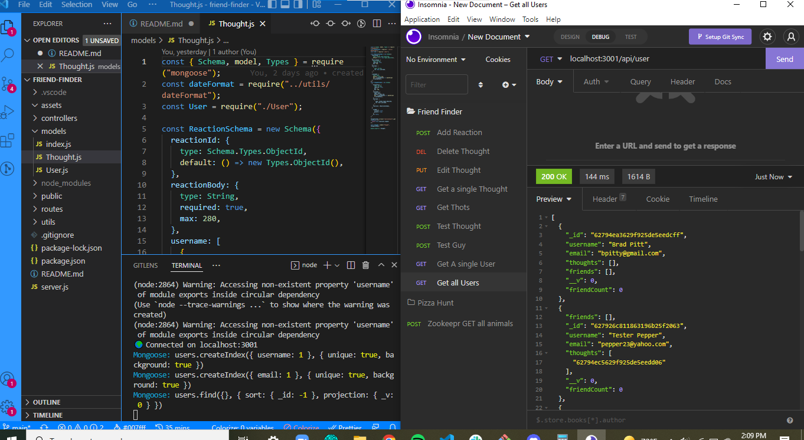

# Friend Finder

## DESCRIPTION

> To maintain a better understanding of Mongoose and MongoDB.
> By creating the backend of a social media platform.
> Allowing the creation and updating of users, posting of "thoughts" and "reactions"
> The development of relations between schemas and models.

## INSTALLATION

> None

## USAGE

None

## LANGUAGES & TECHNOLOGIES

> JavaScript and Express.js, Mongoose, MongoDB, Insomnia

## AUTHOR(S)

>

- [Jacob Ambrose](https://www.github.com/jamborse0)
  >

## LICENSE

## PREVIEW

> 
